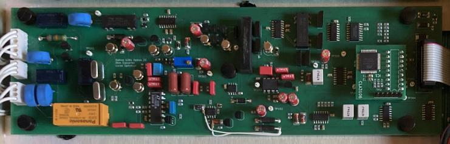
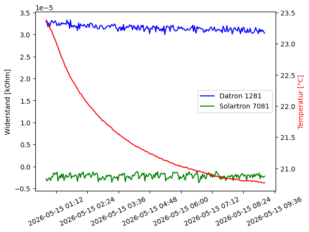

# DIY-Datron-1281-Resistance-Option
Add resistance measurement capabilities to your Datron 1281

I bought a defective Datron 1281. Sadly there was no option installed. So replicated the current measurement board as closely as I could. Most of the parts are still avaiable. The CLA3106 ASIC can be replaced with my CPLD replacement. The only problems are the JFETs for switching the low current ranges and the shunt resistors. The original JFETs were replaced with similar off-the-shelf ones. The shunt resistors are the most expensive part of this project, but there is no real other choice than Vishay foil resistors. Some resistors are custom ordered from Texas Components. The PCB features full mechanical compatibility to the original board and all guard traces.

A full characterization of the resistance option was not possible due to not having access the known standard resistors. I did a comparative measurement in the 10kOhm range with a short against my Solartron 7081. The noise is definitly lower compared to the Solartron meter. At the moment I will see this as a win until I am able to perform better measurements.

